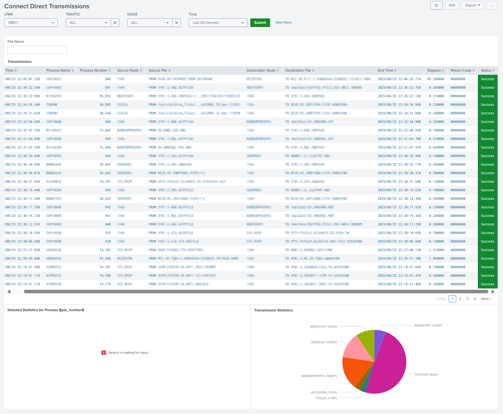
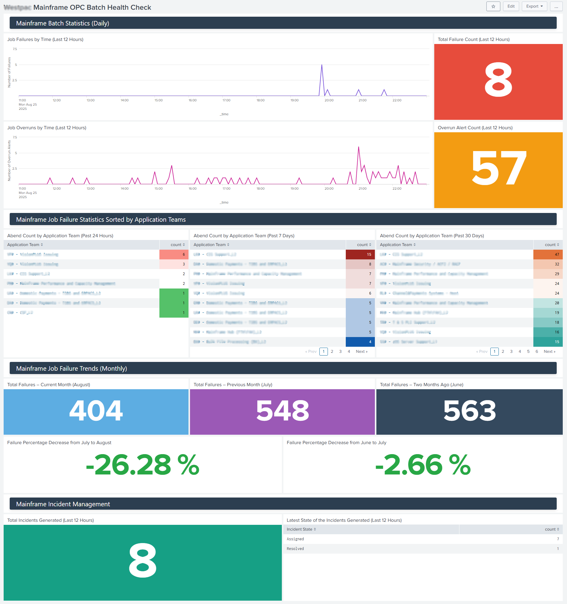

# My-Splunk-ShowReel

Welcome to **My-Splunk-ShowReel**, a curated collection of powerful Splunk dashboards designed to provide deep insights into system health, performance, and operations. Whether you're monitoring infrastructure, ensuring batch processes run smoothly, or tracking data flows, these dashboards deliver real-time analytics to empower informed decision-making.

Explore each dashboard below—complete with visuals and detailed explanations to showcase their unique capabilities and practical applications.

---

## 1) File Transmissions

This dashboard delivers a comprehensive overview of file transmission activities across your network. Track the volume, success rate, and timing of file transfers to quickly identify bottlenecks, failures, or suspicious activity. It's essential for ensuring data flows seamlessly between systems and for troubleshooting transmission delays or errors.

---

## 2) TWS Batch Health Check

Keep your batch processing jobs on track with this dashboard, which offers real-time status monitoring of TWS (Tivoli Workload Scheduler) batch jobs. Detect failures, delays, and performance anomalies early to maintain operational continuity. This dashboard is a critical tool for ensuring that automated workflows execute reliably without interruption.

---

## 3) CPU Overview Usage

Get a high-level snapshot of CPU utilization trends across all monitored servers. This dashboard highlights peak usage periods, underutilized resources, and potential bottlenecks, enabling proactive resource management. It's perfect for capacity planning and spotting unusual spikes that might indicate underlying issues.

---

## 4) CPU Utilization

Dive into granular CPU metrics with this dashboard that visualizes real-time CPU load, core-by-core usage, and process-level performance. Ideal for system administrators who need to diagnose high-load scenarios or optimize workload distribution. It provides actionable insights into how CPU resources are allocated and consumed.

---

## 5) Storage Utilization

Monitor your storage landscape with this dashboard that tracks disk usage, available capacity, and growth trends across critical storage devices. Prevent outages by detecting storage exhaustion early and planning expansions accordingly. This dashboard is key for data lifecycle management and ensuring sufficient space for business operations.

---

## 6) CTM Server Monitoring Dashboard

Focus on the health and operational status of CTM (Control-M) servers with this dedicated dashboard. It tracks server availability, job execution statuses, and performance metrics, allowing for swift troubleshooting of scheduling issues or server downtime. Essential for maintaining automation workflows and job orchestration.

---

## 7) Agent Status

Quickly assess the connectivity and operational status of agents deployed across your infrastructure. This dashboard helps identify inactive or malfunctioning agents that could impact data collection or monitoring coverage. It's an indispensable tool for ensuring your monitoring ecosystem remains robust and responsive.

---

## 8) ESP Health Check

This comprehensive dashboard performs a health assessment of your ESP (Event Stream Processing) system. It visualizes system performance, error rates, and throughput, enabling you to ensure that event processing pipelines are stable and efficient. By identifying potential issues proactively, you can maintain high availability and data integrity.

---
